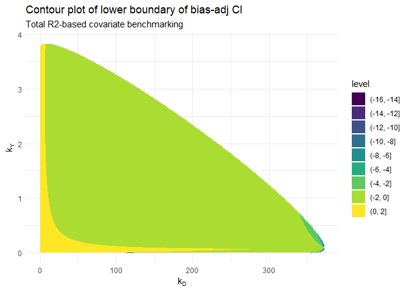

<!-- README.md is generated from README.Rmd. Please edit that file -->

# ovbsa

<!-- badges: start -->
<!-- badges: end -->

The goal of `ovbsa` (omitted variable bias sensitivity analysis) is to
conduct sensitivity analysis of omitted variable bias in linear
econometrics models. For details see Basu (2025).

## Installation

You can install the package `ovbsa` from CRAN with:

``` r
# uncomment this line
# install.packages("ovbsa")
```

You can install the development version of ovbsa from
[GitHub](https://github.com/) with:

``` r
# uncomment these lines
# install.packages("pak")
# pak::pak("dbasu-umass/ovbsa")
```

## Main functions

The main functions in this package are:

- `bsal`: this function conducts basic sensitivity analysis (bsal) and
  reports the bias-adjusted estimate, the bias-adjusted standard error
  and the bias-adjusted confidence interval in a linear regression
  model;

- `saltr2`: this function computes the probability of the conclusion of
  the study being overturned using the total R-squared-based analysis;

- `salpr2ncd`: this function computes the probability of the conclusion
  of the study being overturned using the partial R-squared-based
  analysis without conditioning on the treatment variable;

- `salpr2cd`: this function computes the probability of the conclusion
  of the study being overturned using the partial R-squared-based
  analysis with conditioning on the treatment variable.

Let us first load the relevant libraries and then work through two
examples.

``` r
library(ovbsa)
library(sensemakr)
#> See details in:
#> Carlos Cinelli and Chad Hazlett (2020). Making Sense of Sensitivity: Extending Omitted Variable Bias. Journal of the Royal Statistical Society, Series B (Statistical Methodology).
```

``` r
library(ggplot2)
```

In the examples we will use use the data set `darfur` from the package
`sensemakr`, which studies the effect of exposure to violence on
attitudes towards peace.

## Example 1: Bias-adjusted confidence interval

This is a basic example which shows you how to find the bias-adjusted
estimate, the bias-adjusted standard error and the bias-adjusted
confidence interval in a linear regression model. To use this function
the user needs to choose a benchmark covariate, values of the
sensitivity parameters `kD` and `kY` and the significance level `alpha`
for testing the null hypothesis that the treatment effect is zero.

Here we choose the benchmark covariate as `female`, `kD=3`, `kY=3` and
`alpha=0.05`

``` r
## basic example code
analysis1 <- ovbsa::bsal(
  kd=3,ky=3,alpha=0.05,data=darfur,
  outcome = "peacefactor",
  treatment = "directlyharmed",
  bnch_reg = "female",
  other_reg = c("village","age","farmer_dar","herder_dar",
                "pastvoted","hhsize_darfur")
)
```

Now, let us see the results.

``` r
(analysis1)
#>                        Case 1       Case 2       Case 3
#> r2yd.x            0.021873093  0.021873093  0.021873093
#> r2dz.x            0.008040002  0.027492860  0.027492860
#> r2yz.dx           0.781414454  0.380969988  0.374050471
#> estimate          0.097315819  0.097315819  0.097315819
#> adjusted_estimate 0.045525612  0.029779889  0.030396023
#> adjusted_se       0.010924114  0.018566585  0.018670065
#> adjusted_lower_CI 0.024081595 -0.006666285 -0.006253282
#> adjusted_upper_CI 0.066969628  0.066226063  0.067045329
```

Here Case 1 refers to the total R-squared-based approach; Case 2 refers
to the partial R-squared-based approach without conditioning on the
treatment variable; and Case 3 refers to the partial R-squared-based
approach with conditioning on the treatment variable.

## Example 2: Probability of study’s conclusion being overturned

Continuing with the previous example, we will now compute the
probability that taking account of omitted variable bias will overturn
the conclusion of the study. We will need to choose the significance
level `alpha` for testing the null hypothesis that the treatment effect
is zero, the mode (and median) `k_kd` of the parameter kD, and the mode
(and median) `k_ky` of the parameter kY.

Here we choose `alpha=0.05, k_kd=1, k_ky=1`.

First, we will look at total R-squared based analysis:

``` r
# total r2-based analysis
res1 <- ovbsa::saltr2(
  alpha=0.05,data = darfur, outcome = "peacefactor",
  treatment = "directlyharmed", bnch_reg = "female",
  other_reg = c("village","age","farmer_dar","herder_dar",
                "pastvoted","hhsize_darfur"),
  N = 500, k_kd=1, k_ky=1
)
# probability
(res1$frac_prob_wt)
#> [1] 0.2582741
```

Second: we will see the partial R-squared based analysis without
conditioning on the treatment variable:

``` r
res2 <- ovbsa::salpr2ncd(
  alpha=0.05,data = darfur, outcome = "peacefactor",
  treatment = "directlyharmed", bnch_reg = "female",
  other_reg = c("village","age","farmer_dar","herder_dar",
                "pastvoted","hhsize_darfur"),
  N = 500, k_kd=1, k_ky=1
)
# probability
(res2$frac_prob_wt)
#> [1] 0.3118923
```

Finally, we look at the partial R-squared based analysis with
conditioning on the treatment variable:

``` r
res3 <- ovbsa::salpr2cd(
  alpha=0.05,data = darfur, outcome = "peacefactor",
  treatment = "directlyharmed", bnch_reg = "female",
  other_reg = c("village","age","farmer_dar","herder_dar",
                "pastvoted","hhsize_darfur"),
  N = 500, k_kd=1, k_ky=1
)
# probability
(res3$frac_prob_wt)
#> [1] 0.3384226
```

## Example 3: Contour plot of boundary of bias-adjusted confidence interval

The above functions used to compute the probability of a study’s
conclusion being overturned implicitly used a contour plot of the
boundary of the bias-adjusted confidence interval. The data is available
as an output to be used by researchers to create that plot, if needed.

I will use the output of the total R-squared-based analysis to create
the contour plot. The data frame to construct the contour plot is
available as a data frame in `res1$dataplot`. For the contour plot, we
will need three variables from this data frame: `X1` as the x-axis, `X2`
as the y-axis and `Z3` as the z-axis (value of the lower boundary of the
bias-adjusted confidence interval).

``` r
# the contour plot  
ggplot(data = res1$dataplot, aes(X1, X2, z = Z3)) +
      geom_contour() +
      geom_contour_filled() +
      labs(
        title = "Contour plot of lower boundary of bias-adj CI",
        subtitle = "Total R2-based covariate benchmarking"
      ) +
      xlab(expression(k[D])) +
      ylab(expression(k[Y])) +
      theme_minimal()
#> Warning: Removed 96443 rows containing non-finite outside the scale range
#> (`stat_contour()`).
#> Warning: Removed 96443 rows containing non-finite outside the scale range
#> (`stat_contour_filled()`).
```



For easy reference, the following information about the relevant
variables in the data frame should be noted while constructing contour
plots like the one above:

- when the unadjusted estimate is positive, use `X1` as the x-axis, `X2`
  as the y-axis and `Z3` as the z-axis (value of the lower boundary of
  the bias-adjusted confidence interval);

- when the unadjusted estimate is negative, use `X1` as the x-axis, `X2`
  as the y-axis and `Z4` as the z-axis (value of the lower boundary of
  the bias-adjusted confidence interval).

## References

- Basu, D. (2025). How likely is it that omitted variable bias will
  overturn your results? SSRN Working Paper. Available here:
  <https://dx.doi.org/10.2139/ssrn.4704246>
