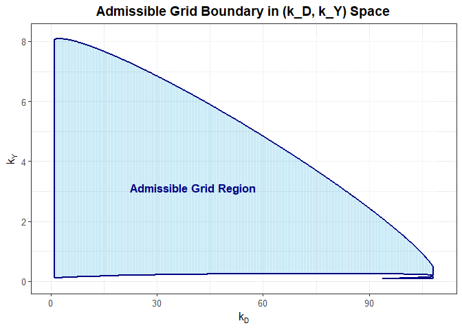

<!-- README.md is generated from README.Rmd. Please edit that file -->

# ovbsa

<!-- badges: start -->

<!-- badges: end -->

The goal of `ovbsa` (omitted variable bias sensitivity analysis) is to
conduct sensitivity analysis of reported results in linear econometrics
models to the presence of omitted variable bias. The key function in
this package computes a bias-adjusted confidence interval by
implementing the method presented in Basu (2026), which, in turn, builds
on and extends Cinelli and Hazlett (2020).

Consider the linear regression of an outcome, $Y$ , on a treatment, $D$,
a set of observed covariates, $X$, and an unobserved confounder, $Z$.
Choose a regressor, $X_j$, that is included in the model, as a
*benchmark covariate*. Let $k_D$ and $k_Y$ denote sensitivity
parameters.

Here $k_D$ captures the strength of association of $Z$ with $D$ relative
to the strength of association of the benchmark covariate, $X_j$, with
$D$. Similarly, $k_Y$ captures the strength of association of $Z$ with
$Y$ relative to the strength of association of $X_j$ with $Y$. The
strengths of associations are measured with partial R-squared
conditional on all the regressors other than the benchmark covariate,
$X_j$.

Cinelli and Hazlett (2020) had presented a method to compute omitted
variable bias-adjusted confidence intervals for specific values of $k_D$
and $k_Y$. Basu (2026) asks us to consider $k_D$ and $k_Y$ as random
variables, identifies their supports, imposes reasonable prior
distributions on these random variables and then computes bias-adjusted
confidence intervals by integrating out $k_D$ and $k_Y$ over their
supports.

In this package, I use independent truncated exponential distributions
as prior distribution of $k_D$ and $k_Y$. For more details see Basu
(2026).

## Installation

You can install the package `ovbsa` from CRAN with:

``` r
# uncomment this line
# install.packages("ovbsa")
```

You can install the development version of ovbsa from
[GitHub](https://github.com/) with:

``` r
# uncomment these lines
# install.packages("pak")
# pak::pak("dbasu-umass/ovbsa")
```

## Main function

The main function in this package is:

- `baci`: this function computes the Bias-Adjusted Confidence Interval
  (baci) in a linear regression model when $k_D$ and $k_Y$ follow
  truncated exponential distributions; the function returns a list
  `results` containing the unadjusted and bias-adjusted confidence
  intervals; it also returns a list `undstats` containing the estimate,
  the unadjusted stamdard error, the max of $k_D$ and the max of $k_Y$;
  it also returns a `ggplot2` plot object visualizing the support of the
  joint distribution of $(k_D,k_Y)$.

Let us first load the relevant libraries and then work through an
example.

``` r
library(ovbsa)
library(sensemakr)
#> See details in:
#> Carlos Cinelli and Chad Hazlett (2020). Making Sense of Sensitivity: Extending Omitted Variable Bias. Journal of the Royal Statistical Society, Series B (Statistical Methodology).
library(ggplot2)
```

In the examples we will use use the data set `darfur` from the package
`sensemakr`, which studies the effect of exposure to violence ($D$) on
attitudes towards peace ($Y$) holding a set of covaraites constant
($X$). The researchers suspects there is an omitted variable ($Z$) and
uses `female` as the benchmark covariate, $X_j$.

## Bias-adjusted confidence interval

This is a basic example which shows you how to find the bias-adjusted
estimate, the bias-adjusted standard error and the bias-adjusted
confidence interval in a linear regression model.

To use this function the user needs to choose a benchmark covariate
(which we have already done), the significance level `alpha` for testing
the null hypothesis that the treatment effect is zero, `N` to create a
grid of size $N \times N$ over the support of the distribution of
$(k_D,k_Y)$ and the medians of the distributions of $k_D$ and $k_Y$
respectively.

The default values of these medians are each set to $1$ (to capture the
idea that the unobserved confounder is as likely to be more strongly
associated with the outcome/treatment as less). If this default seems
reasonable, then the user does not need to choose the medians.
Otherwise, she can choose specific values for `medkd` (median of the
distribution of $k_D$) and `medky` (median of the distribution of
$k_D$).

Here we choose the benchmark covariate as `female`, `alpha=0.05` and
`N=1000` (we use the default values for the medians of the distributions
of $k_D$ and $k_Y$).

In the first step of the analysis, we estimate the model with ordinary
least squares using the `lm` function.

``` r
## fit model
fit <- lm(peacefactor ~ directlyharmed + age + farmer_dar + herder_dar +
             pastvoted + hhsize_darfur + female + village,
             data = sensemakr::darfur)
```

In the second step, we call `baci` to conduct sensitivity analysis.

``` r
# conduct sensitivity analysis
res1 <- ovbsa::baci(fit = fit, treatment = "directlyharmed",
                benchmark = "female", N = 1000, alpha = 5/100)
#> Extracting regression quantities : 0.89 sec elapsed
#> Computing values on the grid : 0.51 sec elapsed
#> Prior distribution: truncated exponential : 1.27 sec elapsed
#> Results available now!
```

Let us see the results, starting with the underlying statistics:

``` r
res1$undstats
#>                 Values
#> estimate    0.09731582
#> std error   0.02325654
#> max(kD)   109.11924031
#> max(kY)     8.17145822
```

The unadjusted estimate and standard errors are `0.097` and `0.023`
respectively. We also see that the maximum values that $k_D$ and $k_Y$
can take are `109.12` and `8.17`, respectively. Thus, the support of
$k_D$ is `[0, 109.12]` and the support of $k_Y$ is `[0,8.17]`.

Let us now see the unadjusted and bias-adjusted confidence intervals.

``` r
res1$results
#>                       Lower     Upper
#> Unadjusted CI    0.05166327 0.1429684
#> Bias-adjusted CI 0.02596471 0.1234509
```

The unadjusted `95%` confidence interval is `[0.052,0.142]` and the
bias-adjusted `95%` confidence interval is `[0.026,0.123]`. Thus, even
after taking account of possible omitted variable bias, the reported
results holds: exposure to violence has a positive impact on the
attitude towards peace; the effect does not wash out once we take
account of omitted variable bias.

Finally, let us see a picture of the support of the joint prior
distribution of $k_D$ and $k_Y$.

``` r
print(res1$support_kdky_plot)
```



While above we have computed the `95%` bias-adjusted confidence
interval, we can change the significane level easily. Here, let us
compute the `90%` and `99%` bias-adjusted confidence intervals.

``` r
# conduct sensitivity analysis: 90% conf int
res2 <- ovbsa::baci(fit = fit, treatment = "directlyharmed",
                benchmark = "female", N = 1000, alpha = 10/100)
#> Extracting regression quantities : 0.93 sec elapsed
#> Computing values on the grid : 0.21 sec elapsed
#> Prior distribution: truncated exponential : 1.08 sec elapsed
#> Results available now!
# conduct sensitivity analysis: 99% conf int
res3 <- ovbsa::baci(fit = fit, treatment = "directlyharmed",
                benchmark = "female", N = 1000, alpha = 1/100)
#> Extracting regression quantities : 0.81 sec elapsed
#> Computing values on the grid : 0.27 sec elapsed
#> Prior distribution: truncated exponential : 1.11 sec elapsed
#> Results available now!
```

Now let us see the results.

``` r
# 90% conf int
res2$results
#>                       Lower     Upper
#> Unadjusted CI    0.05901691 0.1356147
#> Bias-adjusted CI 0.03388222 0.1157064

# 99% conf int
res3$results
#>                       Lower     Upper
#> Unadjusted CI    0.03726458 0.1573671
#> Bias-adjusted CI 0.01039368 0.1385320
```

## References

- Basu, D. (2026). How likely is it that omitted variable bias will
  overturn your results? *Economics Letters*.

- Cinelli, C. and Hazlett, C. (2020). Making Sense of Sensitivity:
  Extending Omitted Variable Bias. *Journal of the Royal Statistical
  Society Series B: Statistical Methodology,* 82(1):39–67
